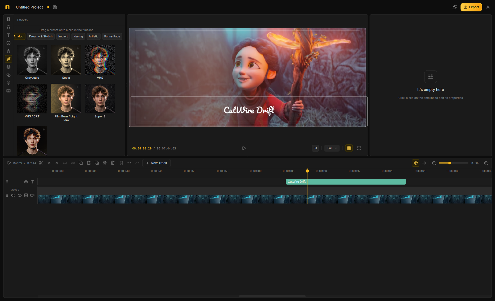

<p align="center">
  
</p>

<h1 align="center">Drift</h1>

<p align="center">
  <strong>Create polished videos fast — free, open, and yours.</strong>
</p>

<p align="center">
  <a href="LICENSE"></a>
  
</p>

<p align="center">
  <a href="https://github.com/CutWire-Studios/Drift">GitHub</a> ·
  <a href="https://github.com/CutWire-Studios/Drift/issues">Issues</a> ·
  <a href="LICENSE">License</a>
</p>

Drift is a free, open-source desktop video editor from CutWire Studios. It brings the speed and simplicity of modern creator tools to your computer: drop in clips, add effects and stickers, generate captions, and export — with no subscription, no watermark, and no account required.

Built with **Qt 6**, **QML**, and **FFmpeg**. Preview and export share one compositor, so what you see is what you get.

## Screenshots

<p align="center">
  
</p>

<p align="center"><em>The Drift editor — timeline, preview, and asset panels</em></p>

## Features

- **Multi-track timeline** — trim, split, snap, ripple, mute/hide tracks, and full undo/redo
- **Effects & transitions** — GPU effects, stylish transitions, and reusable look templates
- **Stickers, emoji, titles & shapes** — finish the look without leaving the editor
- **Auto captions** — speech-to-text captions you can edit on the timeline
- **Cutouts & masks** — isolate subjects, mask clips, and key out green screens
- **Speed & motion** — speed changes, reverse, fades, and animate to the beat of your music
- **Audio tools** — mixing, effect chain, and background noise cleanup
- **Addons** — optional fonts, stickers, effects, and speech models on demand
- **Project bundles** — package a project with its media for easy sharing and backup
- **Export** — MP4 (H.264 + AAC) that matches the preview, with quality presets

## Requirements

| Dependency | Version |
|---|---|
| CMake | ≥ 3.21 |
| C++ compiler | C++20 |
| Qt | 6.5+ (Quick, QuickControls2, Multimedia, Test, Concurrent, Widgets, OpenGL, Network) |
| FFmpeg | 8.x (libavformat, libavcodec, libavutil, libswscale, libswresample, libavfilter) |
| libzstd | any (addon package decompression) |
| OpenSSL | 3.x, libcrypto only (addon signature verification) |

ONNX Runtime powers auto-subtitles (and related ML features). Drift does not link it — only its headers are needed to build, and the library itself is an addon the user installs from the Acceleration category, which is what makes the CPU / CUDA / WebGPU choice theirs rather than the packager's. The headers are downloaded automatically at configure time; pass `-DDRIFT_FETCH_ONNXRUNTIME=OFF` to use a system install instead. A development build also stages a CPU runtime into `<build>/onnxruntime` so it works before anything is installed — `-DDRIFT_BUNDLE_ONNXRUNTIME=OFF` (what the Flatpak manifests use) turns that off, and `DRIFT_ONNXRUNTIME_DIR` points at an extracted release instead.

On Debian/Ubuntu install `libzstd-dev` and `libssl-dev`; on Arch, `zstd` and `openssl`. Neither has a download fallback — configure fails with a pkg-config error if the development headers are missing.

Optional: OpenCV for experimental background-removal builds (`-DWITH_BGREMOVAL=ON`). Only `core`, `imgproc`, and `imgcodecs` are linked.

**Nothing has to be placed by hand.** Fonts, emoji stickers, and speech models are addons (see below), so a clone builds and runs with no bundled assets.

## Build

```bash
cmake -B build -DCMAKE_BUILD_TYPE=Debug
cmake --build build -j$(nproc)
```

Optional OpenCV background removal:

```bash
cmake -B build -DCMAKE_BUILD_TYPE=Debug -DWITH_BGREMOVAL=ON
cmake --build build -j$(nproc)
```

## Run

```bash
./build/drift
```

## Test

```bash
cd build
QT_QPA_PLATFORM=offscreen ctest --output-on-failure
```

Test targets: `Core`, `EditorState`, `Playback`, `Engine`, `MediaProbe`, `AddonPackage`.

`AddonPackage` verifies against a signed fixture in `tests/data/`, so that file has to be checked out with the repo.

## Addons

Fonts, emoji stickers, and speech models download at runtime rather than shipping in the binary. That keeps the install small and lets you take only what you need. Open the Addon Manager from the header (layers icon), or follow the install prompt in the font picker, stickers tab, or auto-subtitle panel.

Packages are `.driftpkg` archives — zstd-compressed, Ed25519-signed, and verified before install — under `<AppDataLocation>/addons/`. Format, registry, and installer live in `src/engine/AddonPackage.*`, `src/engine/AddonRegistry.*`, and `src/models/AddonManager.*`.

**Effects and transitions are bundled *and* addons.** They ship next to the binary so the editor works out of the box; `effects.core` / `transitions.core` addons can ship shader fixes without an app release. Content resolves highest-priority-first:

```
1. $DRIFT_*_DIR          developer override
2. installed addon       downloaded updates
3. <appDir>/<kind>       bundled with the build
4. <AppDataLocation>     hand-placed
```

Catalogs resolve duplicate ids first-root-wins, so an installed `builtin.effects.gaussian_blur` supersedes the bundled one. An addon cannot *remove* a bundled package — the bundled copy reappears when the addon no longer defines that id.

Opening a project that uses an effect or transition with no catalog entry reports it rather than silently dropping it from the render.

To work against local content instead of downloading:

```bash
DRIFT_EFFECTS_DIR=/path/to/effects \
DRIFT_TRANSITIONS_DIR=/path/to/transitions \
DRIFT_FONTS_DIR=/path/to/fonts \
DRIFT_STICKERS_DIR=/path/to/stickers \
DRIFT_WHISPER_MODEL_DIR=/path/to/whisper-small \
  ./build/drift
```

Building and publishing addons lives in a separate repository, along with the Cloudflare Worker that serves them.

### Pointing at a different service

The endpoint and client token are defined in `CMakeLists.txt` and injected as compile definitions — `src/models/AddonEndpoint.h` only reads them.

```bash
cmake -B build -DDRIFT_ADDON_INDEX_URL=https://addons.example.com/v1/index \
               -DDRIFT_ADDON_CLIENT_TOKEN=your-token

cmake -B build -DDRIFT_ADDON_INDEX_URL=      # build with no addon service at all
```

With the service disabled the manager lists and installs nothing; already-installed, side-loaded, and `DRIFT_*_DIR` content still work.

The token is not a secret — it ships in every binary. It exists so the bucket cannot be crawled or hotlinked.

These are CMake *cache* variables: changing the default in `CMakeLists.txt` does not affect an existing build directory, so pass `-D...` again or reconfigure from scratch.

## CLI tools

Built under `build/tools/`:

```bash
# Probe a media file
./build/tools/probe /path/to/video.mp4

# Render one composited frame from a saved project
./build/tools/renderframe project.dcut.json 1000000 out.png
```

Arguments for `renderframe`: `<project.json> <time_us> <output.png>`.

## Project layout

```
src/
  core/           Domain model (Project, Track, Clip, Keyframe, Effect) — no GUI
  engine/         FFmpeg: ClipReader, FrameCompositor, AudioMixer, EffectProcessor, Exporter
  models/         QML-facing models: AppController, AssetLibrary, TimelineModel, ClipListModel
  playback/       PlaybackEngine, PlaybackClock, CompositorService
  preview/        PreviewItem (QQuickItem → QSGTexture)
  qml/            UI panels and components
tests/            Unit tests (ctest) + tests/data (signed addon fixture)
tools/            Headless probe + renderframe
flatpak/          Flatpak / Flathub packaging
cmake/            FindFFmpeg.cmake
```

### CMake targets

| Target | Role |
|---|---|
| `driftcore` | Core domain + JSON persistence |
| `driftengine` | FFmpeg decode, compositing, effects, export |
| `drift` | Qt Quick application |

## Architecture (summary)

**Unified frame server** — Preview and export share `FrameCompositor`:

> “Give me the composited RGBA frame + mixed audio at timeline time T (µs).”

**Time model** — Core timeline positions are `int64_t` microseconds (`drift::TimeUs`). QML uses seconds at the boundary via `AppController`.

**Threading**

| Thread | Responsibility |
|---|---|
| Main (GUI) | QML, models, undo stack, playhead UI |
| Decode workers | `ClipReaderPool` — one thread per active media path |
| Compositor | `CompositorService` — frames off the GUI thread |
| Audio (pull) | `QAudioSink` → `PlaybackClock` (audio-master) |

**Data flow (video)**

```
Media file → ClipReader → EffectProcessor
          → FrameCompositor (transforms, blending, text, masks)
          → PreviewItem (QSGTexture)  |  Exporter
```

**Data flow (audio)**

```
Media file → ClipReader → AudioMixer (volume, fades, audio effects)
          → QAudioSink  |  Exporter
```


## QML entry points

Singletons registered in `main.cpp`:

- `EditorState` / `AppController` — timeline controller
- `AssetLibrary` — media bin

## License

GPLv3 — see [LICENSE](LICENSE).
